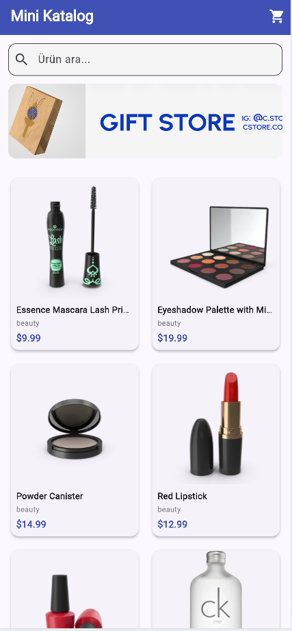
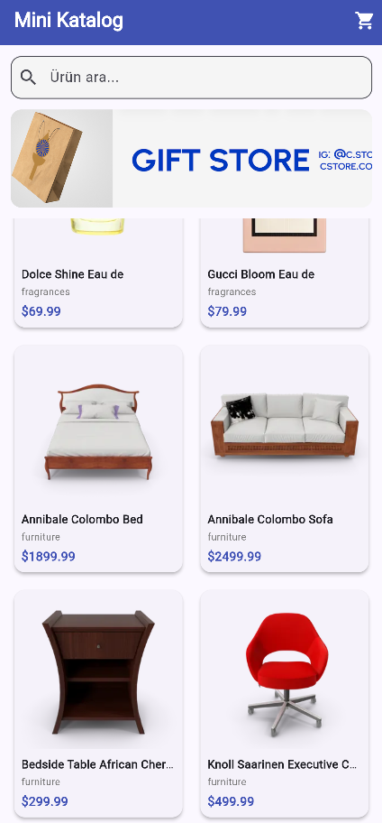

# Mini Katalog Uygulaması

Flutter ile geliştirilmiş, ürünleri listeleyen, ürün detaylarını gösteren ve sepet sistemi içeren basit bir mobil katalog uygulamasıdır. Bu proje, Flutter Günlük Eğitimi kapsamında geliştirilmiştir.

## Özellikler

- Ana sayfa üzerinden ürün listeleme (GridView ile kart tabanlı tasarım)
- Ürün arama ve filtreleme
- Ürün detay sayfası
- Sepete ürün ekleme / sepetten çıkarma
- Sepeti temizleme
- DummyJSON API üzerinden gerçek zamanlı veri çekme

## Kullanılan Teknolojiler

- **Flutter** (sürüm 3.44.2)
- **Dart**
- `http` paketi (API istekleri için)
- [DummyJSON API](https://dummyjson.com/products) (ürün verisi kaynağı)

## Proje Yapısı

```text
lib/
├── main.dart
├── models/
│   └── product.dart
├── screens/
│   ├── home_screen.dart
│   ├── detail_screen.dart
│   └── cart_screen.dart
└── services/
    └── product_service.dart
```

## Ekran Görüntüleri

Ekran görüntüleri `screenshots/` klasöründe yer almaktadır.

### Ana Sayfa



### Ürün Detay


### Sepet İşlemleri


